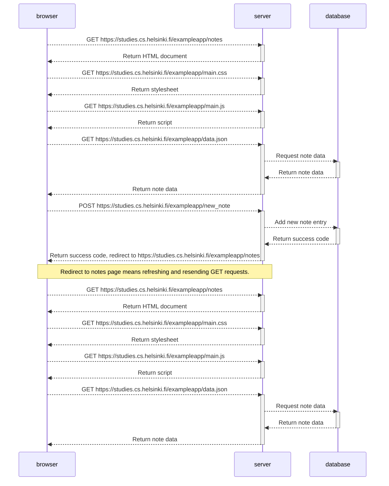

```mermaid
sequenceDiagram
    participant browser
    participant server
    participant database

    browser -->> server: GET https://studies.cs.helsinki.fi/exampleapp/notes
    activate server
    server -->> browser: Return HTML document
    deactivate server

    browser -->> server : GET https://studies.cs.helsinki.fi/exampleapp/main.css
    activate server
    server -->> browser: Return stylesheet
    deactivate server

    browser -->> server: GET https://studies.cs.helsinki.fi/exampleapp/main.js
    activate server
    server -->> browser: Return script
    deactivate server

    browser -->> server: GET https://studies.cs.helsinki.fi/exampleapp/data.json
    activate server
    server -->> database: Request note data
    activate database
    database -->> server: Return note data
    deactivate database
    server -->> browser: Return note data
    deactivate server

    browser -->> server: POST https://studies.cs.helsinki.fi/exampleapp/new_note

    activate server
    server -->> database: Add new note entry
    activate database
    database -->> server: Return success code
    deactivate database
    server -->> browser: Return success code, redirect to https://studies.cs.helsinki.fi/exampleapp/notes
    deactivate server

    Note over browser, server: Redirect to notes page means refreshing and resending GET requests.

    browser -->> server: GET https://studies.cs.helsinki.fi/exampleapp/notes
    activate server
    server -->> browser: Return HTML document
    deactivate server

    browser -->> server : GET https://studies.cs.helsinki.fi/exampleapp/main.css
    activate server
    server -->> browser: Return stylesheet
    deactivate server

    browser -->> server: GET https://studies.cs.helsinki.fi/exampleapp/main.js
    activate server
    server -->> browser: Return script
    deactivate server

    browser -->> server: GET https://studies.cs.helsinki.fi/exampleapp/data.json
    activate server
    server -->> database: Request note data
    activate database
    database -->> server: Return note data
    deactivate database
    server -->> browser: Return note data
    deactivate server

```