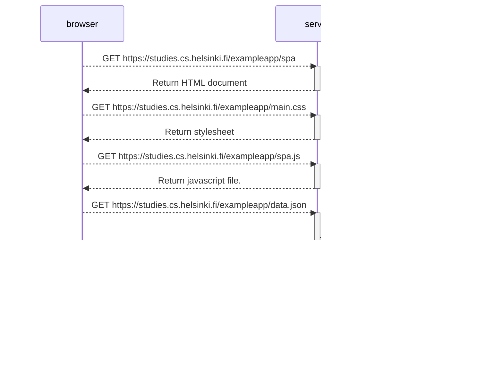

```mermaid
sequenceDiagram
    participant browser
    participant server
    participant database


    browser -->> server: GET https://studies.cs.helsinki.fi/exampleapp/spa
    activate server
    server -->> browser: Return HTML document
    deactivate server

    browser -->> server: GET https://studies.cs.helsinki.fi/exampleapp/main.css
    activate server
    server -->> browser: Return stylesheet
    deactivate server

    browser -->> server: GET https://studies.cs.helsinki.fi/exampleapp/spa.js
    activate server
    server -->> browser: Return javascript file.
    deactivate server

    browser -->> server: GET https://studies.cs.helsinki.fi/exampleapp/data.json
    activate server

    server -->> database: Fetch note data
    activate database
    database -->> server: Return note data
    deactivate database

    server -->> browser: Return note data
    deactivate server

    browser -->> browser: Add notes to HTML document


```